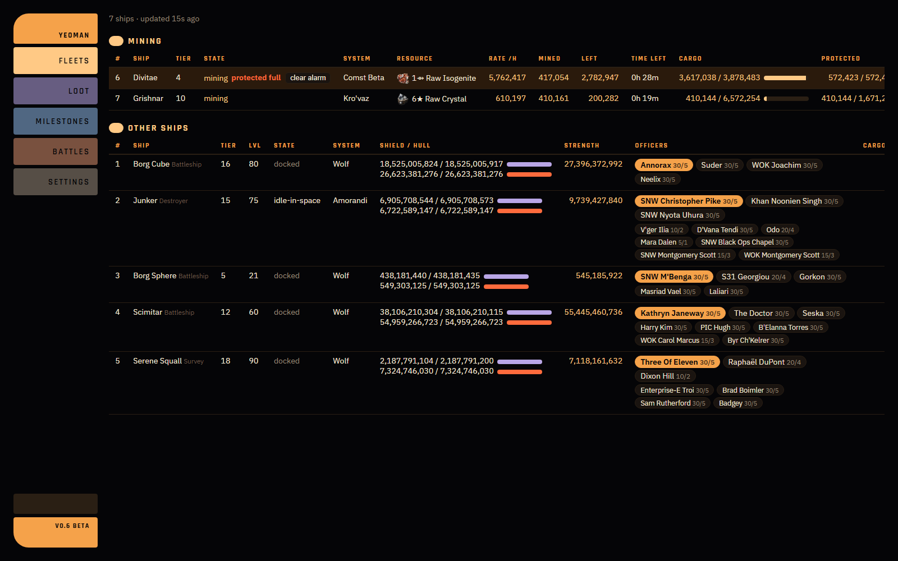
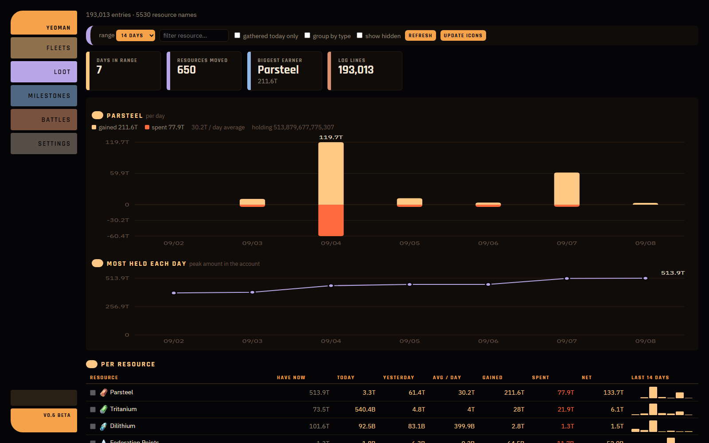
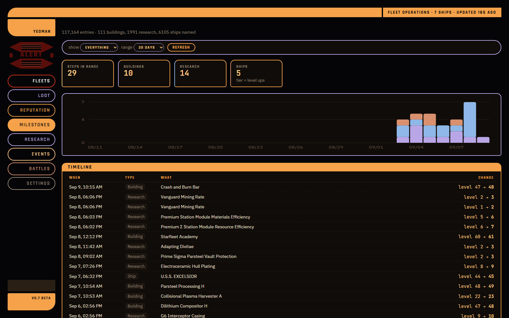
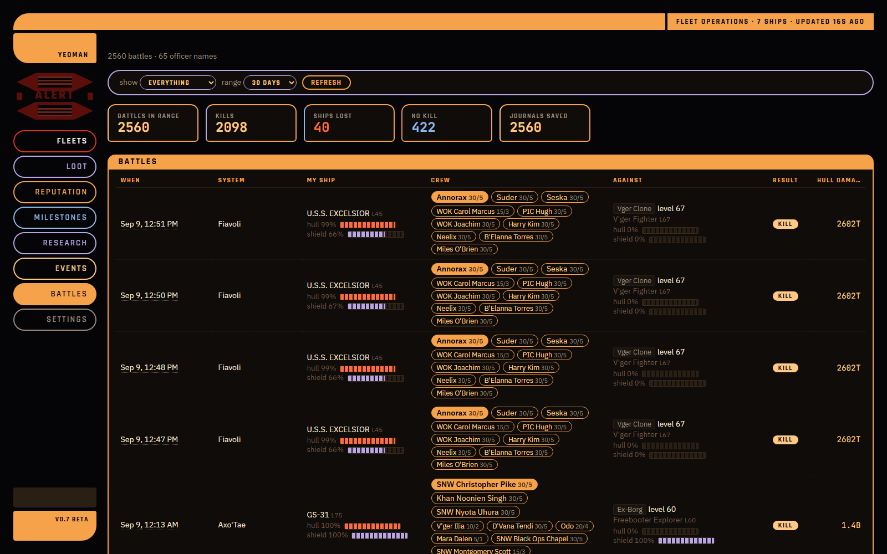
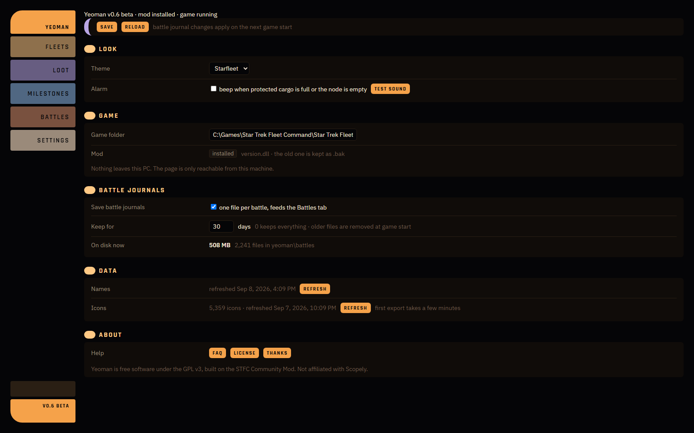

# Yeoman

**A live companion page for Star Trek Fleet Command on PC.**
Your fleets, mining, loot history, faction reputation, research, events and dailies, milestones and
battle results, in a browser tab, updated every few seconds while you play. Nothing leaves your machine.



## What it does today

| Tab | What you see |
|---|---|
| **Fleets** | Every ship: state, system, shield and hull, strength, officers on the bridge and below deck. Mining ships get resource, rate per hour, mined so far, node left, time left, cargo and protected cargo. When protected cargo fills or the node runs dry, the Fleets tab pulses red and an alert graphic lights up in the rail; an optional beep on top. |
| **Loot** | Every resource in the account, tracked over time. Gained, spent and net per day, peak held per day, sparklines, filters, grouping by material family and grade. Built from a log the mod appends every time the game reports a resource change, so offline gains show up too. |
| **Reputation** | Standing with every faction, biggest first. Gained and spent per day, average per day, and a chart of your standing day by day. Same log as Loot, so it works from the first run. |
| **Milestones** | A timeline of building levels, research levels, ship tiers and ship levels, with a per-day chart. |
| **Research** | Every research project the game has, tree by tree, against your levels: Combat, Station, Galaxy, each fleet commander, and so on. Finished, available now, or locked with the building or research that blocks it. Next level's cost and time. Filter by tree type, state and name. |
| **Events** | Dailies grouped by faction with what is done, a star on the ones you care about and a starred done/total tile. Every event with kind (solo or alliance, milestone or leaderboard), state, time left, milestones reached, points and points to the next milestone. Click one for its milestones with claim state. Straight from the game's own event list, re-read every 30 seconds. |
| **Battles** | Each battle: system, your ship and crew, opponent and level, result (kill, no kill, ship lost) and hull damage dealt. Summarised from the game's own battle journals. |
| **Settings** | Theme (five looks, including a Klingon one), alarm, game folder, battle-journal on/off and retention, names and icons refresh, update check and one-click upgrade, About page. |









## How it works

Two parts:

1. **The mod.** A fork of the [STFC Community Mod](https://github.com/netniV/stfc-mod) with extra export
   patches. It runs inside the game as `version.dll` and writes small JSON files into a `yeoman`
   folder inside the game folder: fleets and events every few seconds, the research catalogue once per
   start, and append-only logs for loot, milestones, mining sessions and battles.
   Fork: [frickmanSTFC/stfc-mod](https://github.com/frickmanSTFC/stfc-mod/tree/yeoman), branch `yeoman`.
2. **Yeoman.exe.** This repository. Installs the mod, decodes names from the game's own translation
   cache and icons from its asset cache, reads the logs and serves the page on `http://localhost:8765/`.
   Once installed, the mod starts Yeoman for you every time the game starts.

The page is plain HTML and JavaScript, no framework. The server is Python's standard library.

## Install

1. Close the game.
2. Download the zip from the [latest release](https://github.com/frickmanSTFC/yeoman/releases/latest) and unzip `Yeoman.exe` into a folder of its own, for example `C:\Yeoman`.
3. Run `Yeoman.exe`. The first run asks for the game folder if it is not in the usual place, copies the
   mod into the game folder (any existing `version.dll` is kept as a `.bak` file), then stops.
4. Start the game and play for a minute so the mod writes its first logs.
5. Run `Yeoman.exe` again. It exports icons (a few minutes, once), builds the name table and opens the page.

From then on, start the game. Yeoman opens on its own.

Windows may show a "Windows protected your PC" warning the first time: the exe is new and unsigned.
"More info", then "Run anyway".

## How to update

From inside Yeoman:

1. Settings tab, **Update** group, **check now**. It asks GitHub for the newest release.
2. If there is one: **install and restart**. Yeoman downloads it, swaps its own exe and comes back on
   its own in about half a minute.
3. The game can stay open. The new mod goes in the next time the game is closed and Yeoman runs once.

Yeoman also checks once at start-up and prints a line in its window when something newer is out.

By hand: download the zip from the [latest release](https://github.com/frickmanSTFC/yeoman/releases/latest),
unzip the new `Yeoman.exe` **over the old one in the same folder**, close the game, run it once.
Do not run it straight from the zip window: that runs a temporary copy, which registers a temporary
path as the auto-start and loses its icons.

Every game update breaks the mod until a new build is made, so expect a new release after game patches.
If something goes wrong, `yeoman.log` next to the exe holds everything the window printed.

Details, settings and file locations: [viewer/README.md](viewer/README.md).

## Built on

- [STFC Community Mod](https://github.com/netniV/stfc-mod) by netniV and contributors, GPL v3. The whole
  in-game side: hooking, config, the sync patches this project extends. Yeoman would not exist without it.
- [UnityPy](https://github.com/K0lb3/UnityPy), MIT. Reads the game's icon bundles.
- [Il2CppDumper](https://github.com/Perfare/Il2CppDumper) for finding the game's classes and fields.

## Building it yourself

Two repositories, side by side in one folder. The build script looks for the mod at `..\stfc-mod`.

```
C:\DEV\STFC\
  yeoman\      this repository
  stfc-mod\    the mod fork, branch yeoman
```

### What you need

- Windows 10 or 11, 64-bit.
- [Git](https://git-scm.com/).
- [Python 3.10+](https://www.python.org/downloads/) with `pip install UnityPy pyinstaller`.
- [xmake](https://xmake.io/) (the mod's build tool).
- The Microsoft C++ compiler. Either Visual Studio 2022 with the "Desktop development with C++" workload,
  or the standalone [Build Tools for Visual Studio 2022](https://visualstudio.microsoft.com/visual-cpp-build-tools/).
  In the installer, also tick the **Windows 11 SDK** under Individual Components; older SDKs fail with a
  coroutine header error. The mod's own [CONTRIBUTING.md](https://github.com/netniV/stfc-mod/blob/main/CONTRIBUTING.md) has more.

### Steps

```
cd C:\DEV\STFC
git clone https://github.com/frickmanSTFC/yeoman.git
git clone -b yeoman https://github.com/frickmanSTFC/stfc-mod.git
```

Build the mod (first run downloads its dependencies, a few minutes):

```
cd stfc-mod
xmake -y
```

That produces `build\windows\x64\release\stfc-community-mod.dll`. Then build the exe:

```
cd ..\yeoman\viewer
powershell -ExecutionPolicy Bypass -File build.ps1
```

Result: `viewer\dist\Yeoman.exe`.

Releases are built by [GitHub Actions](.github/workflows/build.yml): every push to `main` runs the same
steps on a clean Windows runner and replaces the single `latest` release with the new zip. The commit it
was built from is stamped into the exe, which is how the in-app update check knows what is newer. A local
build carries no stamp and shows "local build" in Settings.

### Running from source instead

```
cd viewer
pip install UnityPy
python app.py
```

The mod still comes from the exe build, so build that once, or copy `stfc-community-mod.dll` to
`<game>\version.dll` by hand.

### After a game update

The game's code changes, so the mod's hooks need checking. Rebuild the mod, then the exe.
[Il2CppDumper](https://github.com/Perfare/Il2CppDumper) on the game's `GameAssembly.dll` gives the class
and field names to check against `mods\src\patches\parts\fleet_export.cc` and `sync.cc`.

## License

GPL v3, see [LICENSE](LICENSE). Not affiliated with Scopely.
